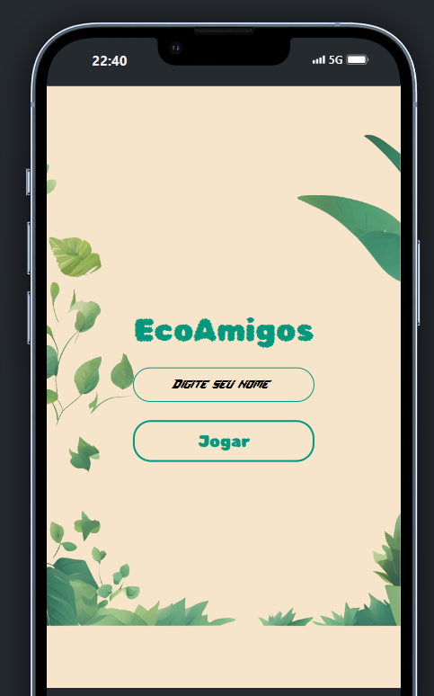

# EcoAmigos

Este é o projeto `EcoAmigos, uma aplicação móvel desenvolvida com Expo e React Native.

## Versão

- **Versão:** 1.0.0

## Scripts

Os seguintes scripts estão disponíveis para gerenciar o projeto:

- `start`: Inicia o servidor Expo.
- `reset-project`: Executa o script para redefinir o projeto (`node ./scripts/reset-project.js`).
- `android`: Inicia o servidor Expo e abre o aplicativo no emulador Android.
- `ios`: Inicia o servidor Expo e abre o aplicativo no simulador iOS.
- `web`: Inicia o servidor Expo para a web.
- `test`: Executa os testes com Jest em modo de observação.
- `lint`: Executa o linting com Expo.

## Dependências

As dependências do projeto incluem:

- **Bibliotecas Expo e React Native:**
  - `@expo/vector-icons`: ^14.0.2
  - `expo`: ~51.0.21
  - `expo-constants`: ~16.0.2
  - `expo-font`: ~12.0.9
  - `expo-linear-gradient`: ~13.0.2
  - `expo-linking`: ~6.3.1
  - `expo-router`: ^3.5.20
  - `expo-splash-screen`: ~0.27.5
  - `expo-status-bar`: ~1.12.1
  - `expo-system-ui`: ~3.0.7
  - `expo-web-browser`: ~13.0.3
  - `react`: 18.2.0
  - `react-native`: 0.74.3
  - `react-native-gesture-handler`: ~2.16.1
  - `react-native-reanimated`: ~3.10.1
  - `react-native-safe-area-context`: ^4.10.8
  - `react-native-screens`: ^3.33.0
  - `react-native-vector-icons`: ^10.1.0
  - `react-native-web`: ~0.19.10
  - `react-redux`: ^9.1.2

- **Outras Bibliotecas:**
  - `axios`: ^1.7.3
  - `express`: ^4.19.2

## Dependências de Desenvolvimento

As dependências de desenvolvimento incluem:

- **Bibliotecas de Teste e Tipagem:**
  - `@babel/core`: ^7.20.0
  - `@types/jest`: ^29.5.12
  - `@types/react`: ~18.2.45
  - `@types/react-native-vector-icons`: ^6.4.18
  - `@types/react-test-renderer`: ^18.0.7
  - `jest`: ^29.2.1
  - `jest-expo`: ~51.0.3
  - `react-test-renderer`: 18.2.0
  - `typescript`: ~5.3.3

## Estrutura do Projeto

- `app/`: Contém arquivos principais do aplicativo, como `index.tsx` e `_layout.tsx`.
- `components/`: Contém componentes reutilizáveis divididos em subdiretórios como `home`, `questionario`, `ranking`, e `template`.
- `assets/`: Contém arquivos de ativos como imagens e fontes.
- `data/`: Contém arquivos de dados necessários para o aplicativo.
- `node_modules/`: Contém dependências do projeto.
- `.expo/`: Diretório gerado pelo Expo.
- `.vscode/`: Configurações do Visual Studio Code.
- `.gitignore`: Arquivos e diretórios a serem ignorados pelo Git.
- `app.json`: Configurações principais do Expo.
- `babel.config.js`: Configurações do Babel.
- `expo-env.d.ts`: Tipos para variáveis de ambiente do Expo.
- `package-lock.json`: Lockfile do npm.
- `package.json`: Configurações do projeto e dependências.
- `README.md`: Este arquivo de documentação.
- `tsconfig.json`: Configurações do TypeScript.

## Uso

Para iniciar o projeto, use um dos seguintes comandos:

- `npm run start` para iniciar o servidor Expo.
- `npm run android` para abrir o aplicativo no emulador Android.
- `npm run ios` para abrir o aplicativo no simulador iOS.
- `npm run web` para iniciar o servidor Expo para a web.

Para executar os testes, use `npm run test`.

Para realizar linting no código, use `npm run lint`.

## Contribuições

Se você deseja contribuir para o projeto, siga as etapas abaixo:

1. Faça um fork do repositório.
2. Crie uma branch para suas alterações (`git checkout -b feature/nome-da-sua-feature`).
3. Faça commit das suas alterações (`git commit -am 'Adiciona nova feature'`).
4. Faça push para a branch (`git push origin feature/nome-da-sua-feature`).
5. Envie um pull request.

## Licença

Este projeto está licenciado sob a [MIT License](LICENSE).
 
